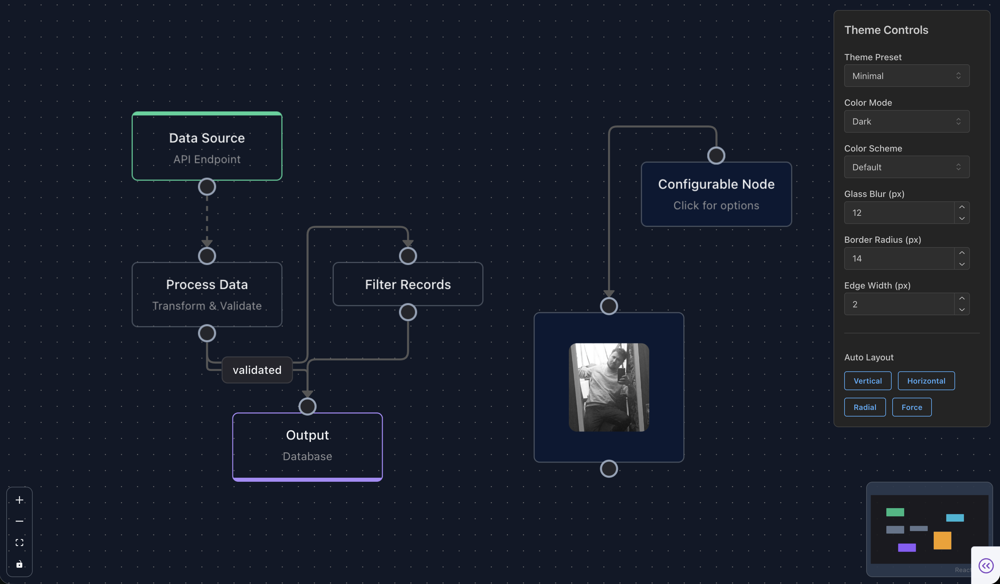

<div align="center">

# dash-flows — React Flow node graphs for Dash

**React Flow ([@xyflow/react](https://reactflow.dev)) node-graph components for [Plotly Dash](https://dash.plotly.com).**

Glass-morphism theming · ELK layouts · DashIconify icons · full Dash callback interoperability.

[](https://pypi.org/project/dash-flows/)
[](https://pypi.org/project/dash-flows/)
[](https://dash.plotly.com/)
[](LICENSE)
[](https://discord.gg/WEnZR35mrK)
[](https://www.youtube.com/channel/UC6Bmo0t0ZUpU_xKBYW0bJuQ)

**[Documentation](https://flows.2plot.dev)** · [Discord](https://discord.gg/WEnZR35mrK) · [YouTube](https://www.youtube.com/channel/UC6Bmo0t0ZUpU_xKBYW0bJuQ) · [GitHub](https://github.com/pip-install-python/dash-flows)

<br/>



<br/>

_Maintained by **[Pip Install Python LLC](https://pip-install-python.com)**._

</div>

---

## Overview

**dash-flows** wraps [React Flow 12](https://reactflow.dev) (`@xyflow/react`) as a Plotly Dash
component library. Build interactive, node-based diagrams — workflows, data pipelines, org charts,
state machines — that talk to your Python callbacks like any other Dash component.

- **React Flow 12.11** under the hood — nodes, edges, handles, minimap, controls, background
- **Glass-morphism theme** with light / dark / system color modes and 6 color schemes
- **ELK layouts** for automatic graph arrangement
- **Rich node & edge types** — default, input, output, group, resizable, circle, toolbar; straight,
  step, smoothstep, bezier, button, data, animated, floating
- **Deep Dash integration** — clicks, selection, connections, drag/drop, context menus, undo/redo,
  copy/paste, save/restore, image export — all as callback props
- **DashIconify icons** and embedded Dash components inside nodes
- **Dash 4.1+** compatible (React 18; docs site developed against 4.2+)

## Installation

```bash
pip install dash-flows
```

## Quick Start

```python
import dash
from dash import html
from dash_flows import DashFlows

app = dash.Dash(__name__)

nodes = [
    {"id": "1", "type": "input",   "data": {"label": "Start"},   "position": {"x": 250, "y": 0}},
    {"id": "2", "type": "default", "data": {"label": "Process"}, "position": {"x": 250, "y": 100}},
    {"id": "3", "type": "output",  "data": {"label": "End"},     "position": {"x": 250, "y": 200}},
]

edges = [
    {"id": "e1-2", "source": "1", "target": "2", "animated": True},
    {"id": "e2-3", "source": "2", "target": "3"},
]

app.layout = html.Div(
    DashFlows(
        id="flow",
        nodes=nodes,
        edges=edges,
        fitView=True,
        showControls=True,
        showMiniMap=True,
        style={"width": "100%", "height": "600px"},
    )
)

if __name__ == "__main__":
    app.run(debug=True)
```

## Documentation

Full documentation, with a **live, runnable demo and source for every example**, lives at the
open-source documentation index maintained by Pip Install Python LLC:

### 📚 **[pip-install-python.com](https://pip-install-python.com)**

You can also run the docs site locally — it is a markdown-driven Dash app served by `run.py`:

```bash
pip install -r requirements-docs.txt
python run.py            # open http://localhost:8560
```

Each page renders live `DashFlows` demos alongside the matching source in `examples/`, plus an
auto-generated prop table. Add a page by dropping a `docs/<topic>/<topic>.md` file with frontmatter
(auto-discovered): `.. exec::` for a live demo, `.. source::` for code, and
`.. kwargs::dash_flows.DashFlows` for a generated prop table. The app supports Dash 4.1+ pluggable
backends via `DASH_BACKEND=flask|fastapi|quart`.

## Components

### Node types

| Component | Description |
|-----------|-------------|
| `DefaultNode` | Standard node with configurable handles |
| `InputNode` | Source node with green accent (output handles only) |
| `OutputNode` | Sink node with purple accent (input handles only) |
| `GroupNode` | Container node for grouping other nodes |
| `ToolbarNode` | Node with floating toolbar on selection |
| `ResizableNode` | Node that can be resized by the user |

### Edge types

| Component | Description |
|-----------|-------------|
| `SimpleBezierEdge` | Smooth curved connection |
| `SmoothStepEdge` | Rounded right-angle connections |
| `StepEdge` | Sharp right-angle connections |
| `StraightEdge` | Direct line connection |
| `AnimatedSvgEdge` | Edge with animated flowing dots |
| `ButtonEdge` | Edge with delete button |
| `DataEdge` | Edge displaying data labels |
| `FloatingEdge` | Connects to the nearest point on each node's border |

### UI components

| Component | Description |
|-----------|-------------|
| `NodeStatusIndicator` | Loading / success / error states for nodes |
| `NodeTooltip` | Hover tooltips for nodes |
| `NodeSearch` | Search and filter nodes |
| `ButtonHandle` | Interactive handle with button styling |
| `DevTools` | Debug panel for development |

## Theming

Dash Flows ships a comprehensive theming system driven by CSS custom properties.

**Theme presets** — apply as a class on the component:

- `.df-theme-glass` (default) — glass morphism with blur effects
- `.df-theme-solid` — opaque cards with shadows
- `.df-theme-minimal` — clean, border-focused design

**Color schemes** — `.df-scheme-default`, `.df-scheme-ocean`, `.df-scheme-forest`,
`.df-scheme-sunset`, `.df-scheme-midnight`, `.df-scheme-rose`.

**Dark mode** is automatic via React Flow's `colorMode="dark"` prop, Mantine's
`data-mantine-color-scheme="dark"` attribute, or a custom `.dark-mode` class.

## Node status indicators

```python
node = {
    "id": "1",
    "data": {
        "label": "Processing...",
        "status": "loading",  # 'initial' | 'loading' | 'success' | 'error'
    },
    "position": {"x": 100, "y": 100},
}
```

- `initial` — no indicator · `loading` — blue pulsing glow · `success` — green border + checkmark ·
  `error` — red border + X badge with shake animation

## Custom icons with DashIconify

```python
from dash_iconify import DashIconify

node = {
    "id": "1",
    "type": "input",
    "data": {
        "label": "Data Source",
        "icon": DashIconify(icon="mdi:database", width=20, color="white"),
        "iconColor": "#10b981",          # icon background color
        "body": "PostgreSQL Database",   # optional description text
    },
    "position": {"x": 100, "y": 100},
}
```

## Handle configuration

```python
node = {
    "id": "1",
    "data": {
        "label": "Custom Handles",
        "handles": [
            {"type": "target", "position": "top",    "id": "input-1"},
            {"type": "target", "position": "left",   "id": "input-2"},
            {"type": "source", "position": "bottom", "id": "output-1"},
            {"type": "source", "position": "right",  "id": "output-2"},
        ],
    },
    "position": {"x": 100, "y": 100},
}
```

## Examples

The `examples/` directory contains **35 runnable apps** — every one is also embedded live (with its
source) in the [documentation](https://pip-install-python.com). A few highlights:

| Example | Description |
|---------|-------------|
| `01_basic_nodes_and_edges.py` | Getting started with nodes and edges |
| `02_all_node_types.py` | Showcase of all node types |
| `03_all_edge_types.py` | Showcase of all edge types |
| `12_elk_layouts.py` | Automatic ELK layouts |
| `14_dash_components_in_nodes.py` | Embed Dash components in nodes |
| `20_context_menu.py` | Right-click context menus |
| `26_floating_edges.py` | Floating edges (nearest-border routing) |
| `32_undo_redo.py` | Full undo / redo system |
| `33_computing_flows.py` | Topological sort & data-flow computation |
| `35_subflows.py` | Collapsible group nodes |

Run any of them directly, e.g. `python examples/01_basic_nodes_and_edges.py`.

## API reference

### `DashFlows` props (selected)

| Prop | Type | Description |
|------|------|-------------|
| `id` | string | Component ID for callbacks |
| `nodes` | list | Array of node objects |
| `edges` | list | Array of edge objects |
| `fitView` | bool | Auto-fit view to content |
| `colorMode` | string | `'light'`, `'dark'`, or `'system'` |
| `themePreset` | string | `'glass'`, `'solid'`, `'minimal'` |
| `colorScheme` | string | `'default'`, `'ocean'`, `'forest'`, `'sunset'`, `'midnight'`, `'rose'` |
| `showControls` / `showMiniMap` / `showBackground` | bool | Toggle canvas overlays |
| `clickedNode` / `selectedNodes` / `lastConnection` | output | Interaction outputs read in callbacks |
| `style` | dict | Container style (must include a height) |

The full, auto-generated prop table (140+ props) is on the
[API Reference](https://pip-install-python.com) page.

### Node object

```python
{
    "id": "unique-id",
    "type": "default",  # 'input', 'output', 'group', 'resizable', ...
    "data": {
        "label": "Node Label",        # primary text
        "sublabel": "Secondary text", # below label
        "body": "Description",        # below sublabel
        "icon": DashIconify(...),     # custom icon
        "iconColor": "#3b82f6",       # icon background
        "layout": "stacked",          # 'stacked' or 'horizontal'
        "handles": [...],             # optional handle config
        "status": "initial",          # 'initial' | 'loading' | 'success' | 'error'
    },
    "position": {"x": 0, "y": 0},
    "style": {},       # optional CSS
    "className": "",   # optional CSS class
}
```

### Edge object

```python
{
    "id": "unique-id",
    "source": "source-node-id",
    "target": "target-node-id",
    "sourceHandle": "handle-id",  # optional
    "targetHandle": "handle-id",  # optional
    "type": "default",            # edge type
    "animated": False,
    "label": "Edge Label",        # optional
    "style": {},
}
```

## Development

```bash
# Install dependencies
npm install
pip install -r requirements.txt

# Build the JS bundle + regenerate the Python wrappers
npm run build

# Run the documentation site (live demos for every example)
pip install -r requirements-docs.txt
python run.py            # http://localhost:8560

# Build a distribution
python -m build
```

The React components in `src/lib/` are the source of truth; the Python package in `dash_flows/` is
auto-generated from their PropTypes by `dash-generate-components`. See
[CONTRIBUTING.md](CONTRIBUTING.md) for the full workflow and validation gates.

## Requirements

- Python >= 3.9
- Dash >= 4.1.0 (the multi-backend floor; developed against Dash 4.2+, still React 18)
- dash-mantine-components >= 2.8.0 (for the examples and docs site)
- Node.js >= 16 (for development / rebuilding the JS bundle)

## Community & support

Come build with us:

- 💬 **Discord** — [discord.gg/WEnZR35mrK](https://discord.gg/WEnZR35mrK)
- ▶️ **YouTube** — [@2plotai](https://www.youtube.com/channel/UC6Bmo0t0ZUpU_xKBYW0bJuQ)
- 🐛 **Issues** — [github.com/pip-install-python/dash-flows/issues](https://github.com/pip-install-python/dash-flows/issues)

## More from Pip Install Python LLC

dash-flows is one of several tools built and maintained by **Pip Install Python LLC**:

| Project | What it is |
|---------|------------|
| 📚 **[Pip Install Python](https://pip-install-python.com)** | Open-source documentation index for the Python & Dash ecosystem |
| 🧠 **[ai-agent.buzz](https://ai-agent.buzz)** | Infinite AI canvas |
| 🎬 **[2plot.media](https://2plot.media)** | Videography application |
| 🛒 **[piraresbargain.com](https://piraresbargain.com)** | Online shop with a tileset & sprite generator |

## License

MIT — see [LICENSE](LICENSE). Built by **[Pip Install Python LLC](https://pip-install-python.com)**.
